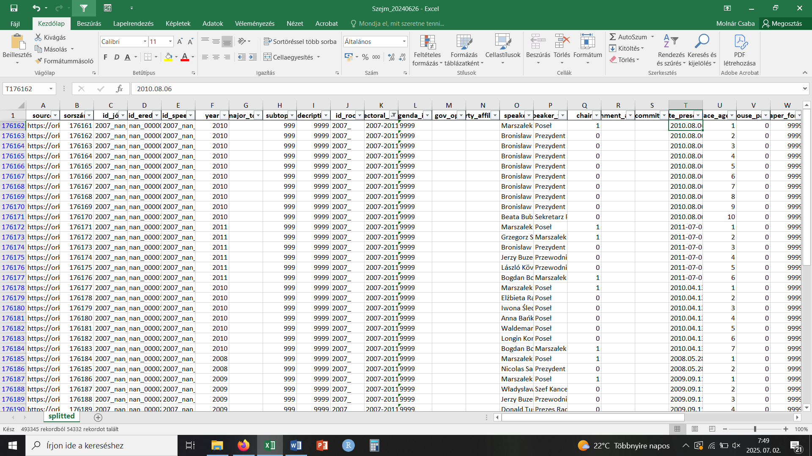
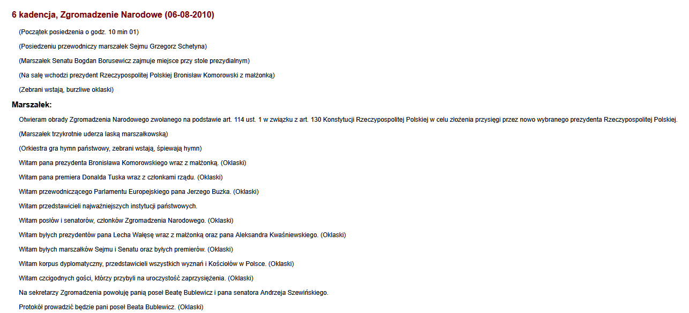
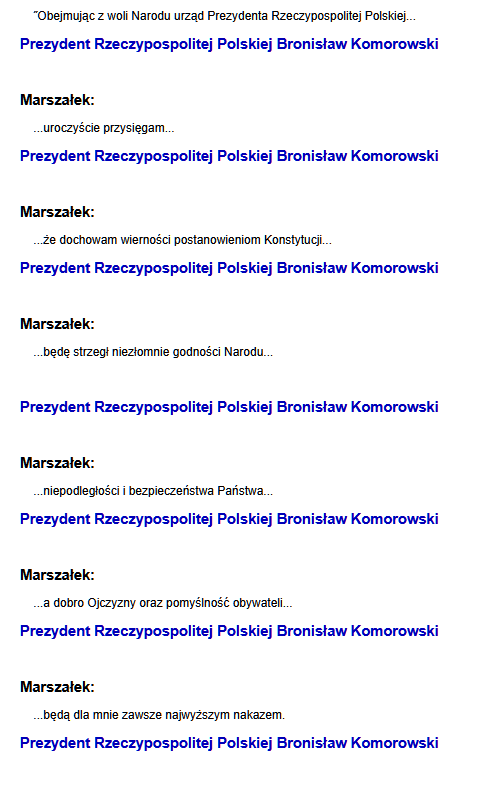
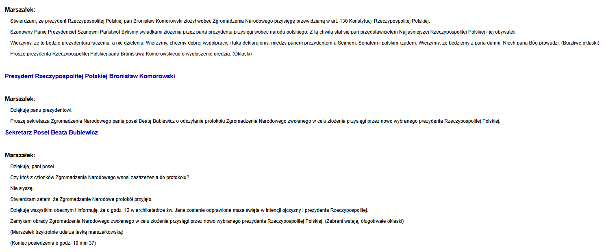
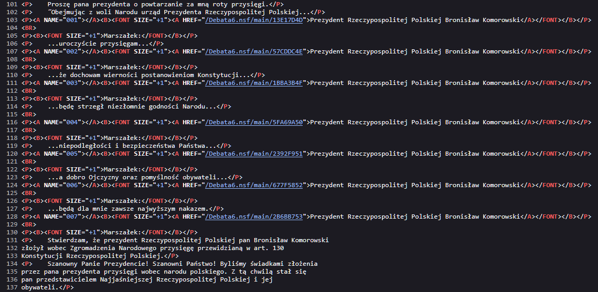

**Webscraping task: segmentation of the Polish parliament's speaker's
speeches**

**Your task is to adjust the data for the provided CSV file based on the
description below.**

Our data for the 1991-2011 Polish parliamentary speeches lacks proper
segmentation regarding the parliament's speaker (if the chair variable's
value is 1 within the dataset). At the beginning of a session, the very
first speech of the speaker contains all of his/her speeches of that
session, and only the other actors' speeches are included thereafter
separately. An example:

2010.08.06
([[https://orka2.sejm.gov.pl/Debata6.nsf/7075e4662b58d9b1c125737f0039d549/87e2b23e4b30becfc125777a002a87f0?OpenDocument]{.underline}](https://orka2.sejm.gov.pl/Debata6.nsf/7075e4662b58d9b1c125737f0039d549/87e2b23e4b30becfc125777a002a87f0?OpenDocument))

{width="6.915172790901138in"
height="2.838179133858268in"}

The speech by the Speaker (Marszalek in Polish) is in the first row
(where the value of chair is 1), followed by other speeches in the next
9 rows (where the value of chair is 0). Out of this, 8 are delivered by
the President of the Republic Bronisław Komorowski, and 1 is delivered
by a secretary (Beata Bublewicz). By clicking the above link, we can see
the Speaker's speech (and some information on the session day in general
in brackets before the name or title of the speaker, which should be
omitted from the corpus):

{width="6.299660979877515in" height="2.875in"}

Further down below, we can find the other speeches with hyperlinks
containing the name and the title of the speaker:

{width="3.9806539807524057in"
height="6.437847769028871in"}

{width="6.912649825021872in"
height="2.875346675415573in"}

The further parts of the speaker\'s speech are among the hyperlinked
text lines. The links themselves point to speeches that already exist in
our data and can be found after the chair\'s speech on each session day.

The task is to split the Speaker's speech into the parts between the
hyperlink texts and create new rows within the dataset for them between
the other speeches on the right places. The metadata of the original row
of the chair's speeches should be used, with the exception of the
following:

-   The "text" should have the split text segment

-   agenda_item: should include the next row's agenda item

-   place_agenda: a running number by session, this variable needs to be
    recreated; each row's value will change based on the new order after
    the segmentation

Place the new, segmented speeches between the already existing rows of
the other actors' speeches where they occur within the given session
day..

This is how the segmentation looks in the page's source:

{width="6.843518153980752in"
height="3.3482338145231845in"}

We can see where the text is between which specific links, which are
already included in the database in the following rows.

**Webscraping task: segmentation of the Polish parliament’s speaker’s
speeches**

**Your task is to adjust the data for the provided CSV file based on the
description below.**

Our data for the 1991-2011 Polish parliamentary speeches lacks proper
segmentation regarding the parliament’s speaker (if the chair variable’s
value is 1 within the dataset). At the beginning of a session, the very
first speech of the speaker contains all of his/her speeches of that
session, and only the other actors’ speeches are included thereafter
separately. An example:

2010.08.06
([<u>https://orka2.sejm.gov.pl/Debata6.nsf/7075e4662b58d9b1c125737f0039d549/87e2b23e4b30becfc125777a002a87f0?OpenDocument</u>](https://orka2.sejm.gov.pl/Debata6.nsf/7075e4662b58d9b1c125737f0039d549/87e2b23e4b30becfc125777a002a87f0?OpenDocument))

The speech by the Speaker (Marszalek in Polish) is in the first row
(where the value of chair is 1), followed by other speeches in the next
9 rows (where the value of chair is 0). Out of this, 8 are delivered by
the President of the Republic Bronisław Komorowski, and 1 is delivered
by a secretary (Beata Bublewicz). By clicking the above link, we can see
the Speaker’s speech (and some information on the session day in general
in brackets before the name or title of the speaker, which should be
omitted from the corpus):

Further down below, we can find the other speeches with hyperlinks
containing the name and the title of the speaker:

The further parts of the speaker's speech are among the hyperlinked text
lines. The links themselves point to speeches that already exist in our
data and can be found after the chair's speech on each session day.

The task is to split the Speaker’s speech into the parts between the
hyperlink texts and create new rows within the dataset for them between
the other speeches on the right places. The metadata of the original row
of the chair’s speeches should be used, with the exception of the
following:

- The “text” should have the split text segment

- agenda_item: should include the next row’s agenda item

- place_agenda: a running number by session, this variable needs to be
  recreated; each row’s value will change based on the new order after
  the segmentation

Place the new, segmented speeches between the already existing rows of
the other actors’ speeches where they occur within the given session
day..

This is how the segmentation looks in the page’s source:

We can see where the text is between which specific links, which are
already included in the database in the following rows.
